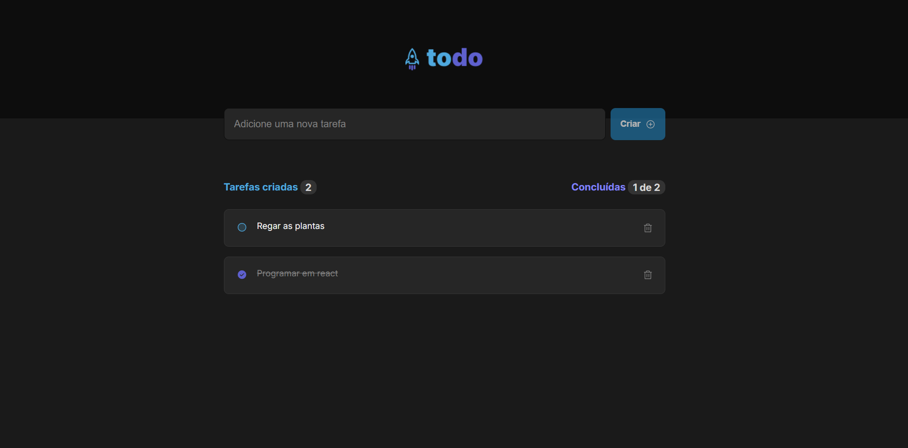

# To-Do List



## 📝 Descrição

O projeto **To-Do List** é um aplicativo simples de lista de tarefas desenvolvido como parte de um desafio em um curso de React. Ele permite que os usuários:  
- Adicionem novas tarefas.  
- Removam tarefas existentes.  
- Marquem tarefas como concluídas.  

Este projeto foi criado como uma forma prática de aprofundar o conhecimento em React e suas funcionalidades.

---

## 🚀 Como Rodar o Projeto

Siga os passos abaixo para executar o projeto localmente:

1. **Clone este repositório**:
   ```bash
   git clone https://github.com/SamilisBrito/todo-list.git

2. **Navegue até o diretório do projeto**:
   ```bash
   cd todo-list

3. **Instale as dependências**:
   ```bash
   npm i

4. **Inicie o servidor de desenvolvimento**:
   ```bash
   npm run dev